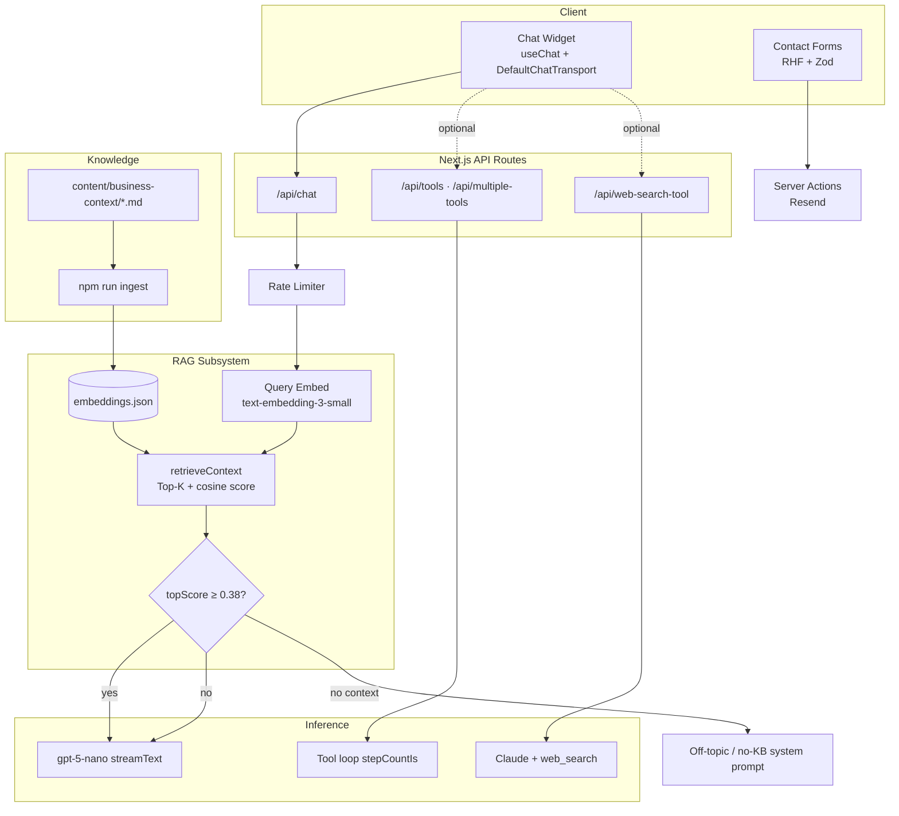

# Programmatic Consumer Web Platform

> **Repository title (GitHub):** `programmatic-consumer-web-platform`  
> **Short description:** Production Next.js consumer site for Programmatic—RAG-powered agentic chat, structured lead capture with automated routing, and dynamic media/content modules for high-intent ISP operators.

---

## Project Overview

This repository hosts **Programmatic’s primary consumer-facing web application**: a full-stack marketing and conversion platform built on the Next.js App Router. The site communicates systems-integration and operational-engineering services to fiber and wireless ISP operators, while operating as a live product surface for:

1. **Contact & lead capture** — Multi-tier intake (lightweight contact, high-intent consultation, Calendly scheduling) with server-side validation, transactional email delivery, and structured payloads optimized for CRM ingestion and sales workflows.
2. **AI-driven conversational chatbot** — A production RAG assistant grounded in curated business context, with optional agentic API routes (tool use, web search, multimodal) for experimentation and extension.
3. **Interactive content portal** — Embedded BunnyCDN video, ImageKit-backed assets, animated process modules, and service-specific landing experiences designed for creator-grade media and engagement.

The application is optimized for **Vercel-style serverless deployment**, with secrets confined to server routes, embedding cache for retrieval latency, and in-memory rate limiting on public AI endpoints.

**Production URL (metadata):** `https://www.programmatic-it.com`

---

## Core Capabilities

### 1. Contact & Lead Capture

| Surface | Route / component | Behavior |
|--------|-------------------|----------|
| Consultation intake | `/contact`, homepage embed — `ContactFormMain` | Zod-validated fields: name, work email, company, job title, solution interest, operational challenge, existing systems (NMS/CRM/billing), project narrative. Submitted via React Hook Form → Next.js Server Action → **Resend** HTML email to operations inbox. |
| Lightweight contact | `ContactForm` (`contactme.tsx`) | First/last name, email, ops-context message; same Resend pipeline with distinct template. |
| Scheduling | `CalendlyWidget` | Embedded scheduling on homepage and contact page for direct calendar conversion. |
| Bot-assisted discovery | `ChatbotWidget` | Floating RAG widget on all primary routes; answers product/pricing/process questions before form submission. |

Lead data is structured at capture time (systems stack, challenge taxonomy, solution interest) so downstream **CRM workflows** (HubSpot, Sonar, custom stacks referenced in copy) receive actionable context without re-discovery calls.

**Server modules:** `src/lib/email.ts`, `src/lib/schemas.ts`, `src/lib/schemasmain.ts`, `src/lib/env.ts`

---

### 2. AI-Driven Conversational Chatbot (RAG + Agentic Routes)

#### Production path (`/api/chat`)

The consumer-facing widget (`src/components/chatbotui/chat-widget/page.tsx`) streams responses from **`POST /api/chat`** using the Vercel AI SDK (`streamText`, `useChat`, `DefaultChatTransport`).

**RAG pipeline:**

1. User message arrives with full UI message history (validated by `chatBodySchema`).
2. Latest user utterance is embedded with OpenAI `text-embedding-3-small`.
3. Cosine similarity ranks chunks from `content-cache/embeddings.json` (built from `content/business-context/**/*.md`).
4. Top-*K* chunks (default 8, max ~8k chars context) are injected into the system prompt.
5. **Relevance gate:** if top similarity &lt; `RELEVANCE_THRESHOLD` (0.38), an off-topic refusal is streamed instead of hallucination.
6. **Cache guard:** if no embedding cache exists, a fixed “knowledge base unavailable” response is enforced—no general-knowledge fallback.

**Model:** `gpt-5-nano` (OpenAI via `@ai-sdk/openai`)

#### Agentic / multi-capability API routes (playground & extension)

These routes demonstrate tool-augmented and multimodal patterns; wire the widget or internal tools to alternate endpoints as needed:

| Endpoint | Capability |
|----------|------------|
| `/api/tools` | Single-tool agent loop (`getWeather`), `stepCountIs(2)` |
| `/api/multiple-tools` | Multi-tool orchestration (`getLocation` + `getWeather`), `stepCountIs(3)` |
| `/api/web-search-tool` | Anthropic Claude + `web_search` tool, sources streamed |
| `/api/multi-modal-chat` | Vision-capable chat (`gpt-4o-mini`) |
| `/api/client-side-tools` | ImageKit upload tool (server-side private key) |
| `/api/generate-image`, `/api/generate-speech`, `/api/transcribe-audio` | Media generation & ASR |
| `/api/structured-data`, `/api/structured-array`, `/api/structured-enum` | Schema-constrained outputs |
| `/api/api-tool` | External weather API integration |
| `/api/completion`, `/api/stream` | Baseline completion streaming |

All public chat routes apply **sliding-window rate limiting** (20 req/min per IP or IP+Bearer composite key).

**RAG library:** `src/lib/rag/{docs,ingest,retrieve}.ts` · **Ingest CLI:** `npm run ingest`

---

### 3. Interactive Content Portal

| Integration | Implementation | Purpose |
|-------------|----------------|---------|
| **BunnyCDN** | `BunnyVideoPlayer` — iframe embed to `iframe.mediadelivery.net` | Portrait/landscape hero video, autoplay/mute/loop, configurable `videoLibraryId` / `videoId`, start offset via `t=` query param |
| **ImageKit** | `next.config.ts` remote patterns + `/api/client-side-tools` | Optimized remote images; server-side upload for agentic image workflows |
| **Dynamic modules** | `ProcessSection`, `Service-filter`, pricing sections, `BotDetection` | Interactive cards, metadata-tagged service pipelines, scroll-driven animations (Framer Motion / Motion) |
| **Analytics visuals** | `line-chart`, `Timeline`, `world-map` | Embedded data storytelling on homepage and service pages |

Content strategy and digital-architecture routes extend the portal pattern for campaign-specific experiences.

---

## Technical Stack

| Layer | Technology |
|-------|------------|
| **Framework** | Next.js 16 (App Router), React 19, TypeScript 5 |
| **Styling** | Tailwind CSS 4, CSS Modules, Framer Motion / Motion |
| **UI primitives** | Radix UI, Headless UI, shadcn-style contact components |
| **Forms** | React Hook Form + Zod resolvers |
| **AI / LLM** | Vercel AI SDK 5 (`ai`, `@ai-sdk/openai`, `@ai-sdk/anthropic`, `@ai-sdk/react`) |
| **Embeddings** | OpenAI `text-embedding-3-small`, cosine similarity retrieval |
| **Email** | Resend (transactional lead notifications) |
| **Scheduling** | react-calendly |
| **Media CDN** | BunnyCDN (video), ImageKit (images) |
| **Charts** | Recharts |
| **Security** | Zod request validation (`src/lib/validation.ts`), env centralization (`src/lib/env.ts`), rate limiting (`src/lib/rate-limit.ts`) |

---

## Architecture: RAG & Agentic Flow



### Request lifecycle (`/api/chat`)

```
User message
    → rateLimitResponse (429 if exceeded)
    → parseBody(chatBodySchema)
    → retrieveContext(query) → { context, topScore }
    → if !embeddings cache → NO_KNOWLEDGE_BASE_SYSTEM
    → if topScore < RELEVANCE_THRESHOLD → OFF_TOPIC_SYSTEM
    → else inject "## Context from our business docs" + streamText
    → toUIMessageStreamResponse (SSE to client)
```

---

## Repository Structure

```
├── content/business-context/   # Markdown knowledge base for RAG
├── content-cache/
│   └── embeddings.json         # Precomputed chunk embeddings (required at runtime)
├── scripts/ingest-docs.ts      # CLI entry for embedding rebuild
├── public/                     # Static assets, OG images
├── src/
│   ├── app/                    # App Router pages & API routes
│   │   ├── api/chat/           # Production RAG chat
│   │   ├── contact/            # Lead capture + Calendly
│   │   ├── pricing|services|about|...
│   ├── components/
│   │   ├── chatbotui/          # Widget + AI playground pages
│   │   ├── contactui/          # Form primitives
│   │   └── features/           # Marketing sections, Bunny player
│   └── lib/
│       ├── rag/                # docs, ingest, retrieve
│       ├── email.ts            # Resend server actions
│       ├── env.ts              # Secret accessors
│       ├── rate-limit.ts
│       └── validation.ts
└── .env.example
```

---

## Local Development

### Prerequisites

- **Node.js** 20+ (LTS recommended)
- **npm**, **yarn**, or **pnpm**
- **OpenAI API key** (chat + ingest)
- **Resend** credentials (contact forms)
- Optional: Anthropic, ImageKit, Weather API keys for extended routes

### Installation

```bash
git clone <repository-url>
cd programmatic-consumer-web-platform   # or your local folder name
npm install
```

### Environment

```bash
cp .env.example .env.local
```

| Variable | Required | Scope |
|----------|----------|-------|
| `OPENAI_API_KEY` | **Yes** (chat + ingest) | Server |
| `RESEND_API_KEY` | Yes (forms) | Server |
| `RESEND_FROM_EMAIL` | Yes | Server |
| `YOUR_EMAIL` | Yes (lead destination) | Server |
| `ANTHROPIC_API_KEY` | No (`/api/web-search-tool`) | Server |
| `IMAGEKIT_*` | No (`/api/client-side-tools`) | Server |
| `WEATHER_API_KEY` | No (`/api/api-tool`) | Server |

Never commit `.env.local`. Rotate keys if exposed.

### Build knowledge base (required before RAG chat works)

```bash
npm run ingest
```

This chunks all `.md` files under `content/business-context/`, embeds them, and writes `content-cache/embeddings.json`. Re-run after any knowledge-base edit.

### Run dev server

```bash
npm run dev
```

Open [http://localhost:3000](http://localhost:3000). The chat widget appears on homepage, contact, pricing, services, about, and digital-architecture routes.

### Production build (local smoke test)

```bash
npm run build
npm run start
```

---

## Production Deployment

### Recommended host

**Vercel** (or any Node-compatible platform supporting Next.js 16 with webpack bundling as configured).

### Environment variables

Configure the same keys as `.env.example` in the hosting provider’s **Production** and **Preview** environments. Mark all API keys as **server-only** (no `NEXT_PUBLIC_` prefix for secrets).

### RAG embedding cache (choose one strategy)

| Strategy | Steps |
|----------|-------|
| **A — Committed cache** | Run `npm run ingest` locally, commit `content-cache/embeddings.json`, deploy. Re-ingest and commit when `content/business-context/` changes. |
| **B — Build-time ingest** | Set build command to: `npm run ingest && npm run build`. Ensure `OPENAI_API_KEY` is available at **build** time. |

Without `embeddings.json`, `/api/chat` returns the “knowledge base not loaded” message only.

### Build settings

- **Install command:** `npm install` (or `yarn` / `pnpm` per lockfile)
- **Build command:** `npm run build` (or ingest + build per strategy B)
- **Output:** Next.js default (`.next`)

### `next.config.ts` notes

- ImageKit remote pattern: `ik.imagekit.io`
- Webpack alias for `motion/react` resolution

### Rate limiting in serverless

The in-memory limiter (`src/lib/rate-limit.ts`) is **per instance**, not globally distributed. Adequate for typical marketing traffic. For strict global quotas, replace with Vercel KV, Upstash Redis, or edge middleware.

### Security checklist

- [ ] All secrets in platform env vars, not in repo
- [ ] `IMAGEKIT_PRIVATE_KEY` only in server routes
- [ ] Resend domain verified for `RESEND_FROM_EMAIL`
- [ ] Review `RELEVANCE_THRESHOLD` if off-topic false positives occur
- [ ] Re-ingest embeddings after business-context updates

### Observability

`/api/chat` logs token usage (`inputTokens`, `outputTokens`, `totalTokens`) per request via `result.usage`. Extend with your APM or log drain as needed.

---

## Updating the Knowledge Base

1. Add or edit Markdown under `content/business-context/` (see `content/business-context/README.md`).
2. Run `npm run ingest`.
3. Commit updated `content-cache/embeddings.json` (if using strategy A) or redeploy (strategy B).
4. Smoke-test the widget with domain-specific and off-topic queries.

---

## API Reference (Production Chat)

**`POST /api/chat`**

- **Body:** `{ messages: UIMessage[] }` (validated; max 100 messages, length limits per `src/lib/validation.ts`)
- **Response:** UI message stream (SSE)
- **Headers:** Standard; rate limit returns `429` with `Retry-After`

---

## License & Ownership

Proprietary — Programmatic (AI Automation Agency). Internal use and authorized deployments only unless otherwise specified by the rights holder.

---

## Quick Reference

```bash
npm run dev      # Development server (webpack)
npm run build    # Production build
npm run start    # Serve production build
npm run ingest   # Rebuild RAG embedding cache
```
